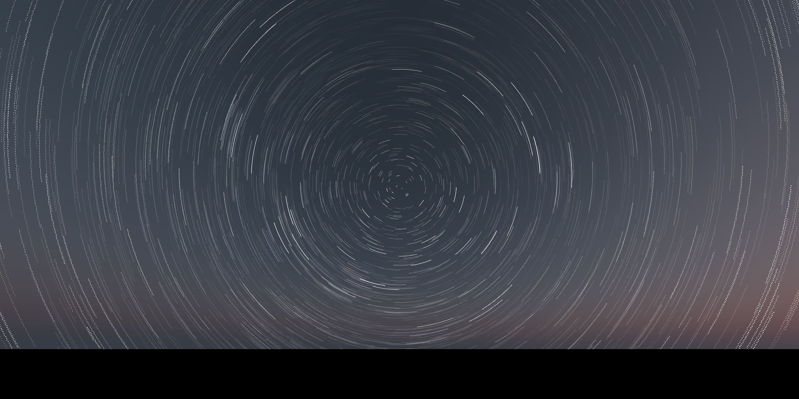

skymodelr 
=========================================================
</img>

Overview
--------

**skymodelr** generates physically‑plausible sky domes and night skies as high‑dynamic‑range EXR images directly from R. It implements the Hosek–Wilkie analytic sky model and (optionally) the 2021–22 Prague spectral sky model (below‑horizon sun, altitude, and wide‑spectrum support). It also includes tools to add the moon as well as accurate visible **star fields** aligned to observer location/time. Outputs are lat‑long environment maps (2:1 equirectangular) that you can feed into renderers (such as *rayrender*).

Use
--------

`generate_sky_latlong()` composes a full sky environment using the functions  `generate_sky()`, `generate_moon_latlong()`, and `generate_stars()` for a specific latitude, longitude, and time. By default `generate_sky_latlong()` only includes the sun's contribution, but you can also include stars and the moon by setting `moon = TRUE` and `stars = TRUE`.

Installation
------------

``` r
# Latest version from GitHub
remotes::install_github("tylermorganwall/skymodelr")
```

If you plan to use the Prague spectral model, download its coefficient dataset(s) once (see `download_sky_data()` below).

Functions
---------


- `generate_sky()` — Write/return an EXR sky dome using either the Hosek–Wilkie (default) or Prague model.
  - `outfile = NA` to return the HDR array in‑memory (otherwise a `.exr` is written).
  - `albedo = 0.5` ground reflectance (0–1).
  - `turbidity = 3` atmospheric turbidity (1.7–10; Hosek only).
  - `elevation = 10`, `azimuth = 90` solar position (degrees).
  - `altitude = 0` observer altitude in meters (Prague only).
  - `resolution = 2048` image height (width is `2 * resolution`).
  - `numbercores = 1` threads.
  - `hosek = TRUE` set `FALSE` to use the Prague model; Prague options `wide_spectrum`, `visibility`.
  - `render_solar_disk = TRUE` set `FALSE` to render the atmospheric scattering effects without the solar disk.

- `generate_sky_latlong()` — Produce a complete equirectangular sky array/EXR. Accepts date/time and observer location, and (optionally) adds stars and a moon‑lit atmosphere.
  - Core args: `outfile = NA`, `datetime`, `lat`, `lon`, `albedo`, `turbidity`, `altitude`, `resolution`, `numbercores`.
  - Model selection: `hosek = TRUE` (Hosek–Wilkie) or set `hosek = FALSE` to use the Prague spectral model; Prague extras: `wide_spectrum`, `visibility`.
  - Composition: `stars = FALSE`, `star_width`, `moon = FALSE`.

- `generate_moon_latlong()` — Produce a moon‑lit atmosphere by scaling a sky dome to the moon’s luminance (phase + opposition surge). Computes the moon’s position from time/location. Arguments mirror `generate_sky_latlong()`.

- `generate_stars()` — Synthesize a star‑field EXR aligned with the sky dome:
  - `outfile = NA`, `resolution = 2048`.
  - `zero_point = 1` exposure scale (larger → brighter stars).
  - `lon_deg`, `lat_deg` observer longitude/latitude (deg) and `time_utc` (UTC; used for local sidereal time).
  - Optional extinction/appearance controls: `turbidity`, `ozone_du`, `altitude`, `star_width`, `atmosphere_effects`, `upper_hemisphere_only`, `numbercores`.

### Data & helpers

- `calculate_sky_values()` — Sample radiance from the Prague model for given sky directions (`phi`, `theta`) and conditions (`elevation`, `altitude`, `visibility`, `albedo`, `azimuth`). Useful for analysis and custom shaders.
- `download_sky_data(sea_level = TRUE, wide_spectrum = FALSE)` — Download Prague model coefficient data:
  - Sea‑level, standard spectrum: `SkyModelDatasetGround.dat` (~107 MB)
  - Sea‑level, wide spectrum: `PragueSkyModelDatasetGroundInfra.dat` (~574 MB)
  - Full‑altitude dataset: `SkyModelDataset.dat` (~2.4 GB)
- `run_documentation()` — Internal helper to gate heavier examples in docs.

Usage
-----

```{r setup, include = FALSE}
library(knitr)
knitr::opts_chunk$set(
  fig.path = "man/figures/",
  cache = TRUE
)
set.seed(1001)
```

## Basic usage

Morning in DC:

```{r full_sky, message=FALSE, warning=FALSE}
library(skymodelr)
library(rayimage)

env = generate_sky_latlong(
  outfile    = NA,
  datetime   = as.POSIXct("2025-03-21 06:15:00",tz="EST"),
  lat        = 38.9072,
  lon        = -77.0369,
  resolution = 800
)
rayimage::plot_image(env)
```

Afternoon in DC:

```{r full_sky_afternoon, message=FALSE, warning=FALSE}
library(skymodelr)
library(rayimage)

env = generate_sky_latlong(
  outfile    = NA,
  datetime   = as.POSIXct("2025-03-21 12:15:00",tz="EST"),
  lat        = 38.9072,
  lon        = -77.0369,
  resolution = 800
)
rayimage::plot_image(env)
```

Evening in DC:

```{r full_sky_evening, message=FALSE, warning=FALSE}
library(skymodelr)
library(rayimage)

env = generate_sky_latlong(
  outfile    = NA,
  datetime   = as.POSIXct("2025-03-21 18:00:00",tz="EST"),
  lat        = 38.9072,
  lon        = -77.0369,
  resolution = 800
)
rayimage::plot_image(env)
```

## Custom sun position, multicore, no solar disk

```{r sky_basic, message=FALSE, warning=FALSE}
sky = generate_sky(
  outfile = NA,
  albedo = 0.2,
  turbidity = 3,
  elevation = 15,
  azimuth = 135,
  resolution = 800,
  numbercores = 2,
  hosek = TRUE,
  render_solar_disk = FALSE
)
rayimage::plot_image(sky)
```

## Moon‑lit atmosphere

```{r sky_moon, message=FALSE, warning=FALSE}
moon_sky = generate_moon_latlong(
  outfile   = NA,
  datetime  = as.POSIXct("2025-03-21 02:15:00",tz="EST"),
  lat       = 38.9072,
  lon       = -77.0369,
  albedo    = 0.2,
  turbidity = 3,
  resolution = 800,
  hosek = TRUE
)
#Increase exposure
moon_sky |> 
  rayimage::render_exposure(17) |> 
  rayimage::plot_image()
```

## Star field aligned to time and place

```{r stars_basic, message=FALSE, warning=FALSE}
stars = generate_stars(
  outfile   = NA,
  datetime  = as.POSIXct("2025-03-21 02:15:00",tz="EST"),
  lat       = 38.9072,
  lon       = -77.0369,
  resolution = 800,
  atmosphere_effects = TRUE,
  upper_hemisphere_only = TRUE
)
stars |> 
  render_exposure(5) |> 
  rayimage::plot_image()
```

Now render the entire sphere:

```{r stars_basic_full, message=FALSE, warning=FALSE}
stars_full = generate_stars(
  outfile   = NA,
  datetime  = as.POSIXct("2025-03-21 02:15:00",tz="EST"),
  lat       = 38.9072,
  lon       = -77.0369,
  resolution = 800,
  atmosphere_effects = FALSE,
  upper_hemisphere_only = FALSE
)
stars_full |> 
  render_exposure(5) |> 
  rayimage::plot_image()

```

## Use the Prague spectral model

```{r prague_model, eval=FALSE}
# Download once (choose variant via args):
coef_path = download_sky_data(sea_level = TRUE, wide_spectrum = FALSE)

# Render with the Prague model:
sky_prague = generate_sky(
  albedo = 0.3,
  elevation = 10,
  azimuth = 90,
  altitude = 0,
  hosek = FALSE,
  wide_spectrum = FALSE,
  visibility = 50,
  resolution = 2048,
  numbercores = 4
)
```

Acknowledgements
----------------

- Hosek–Wilkie sky model (analytic daylight model).
- Prague 2021–22 spectral sky model (wide‑spectrum, below‑horizon sun, altitude).
- Star positions from the Yale Bright Star Catalog.
